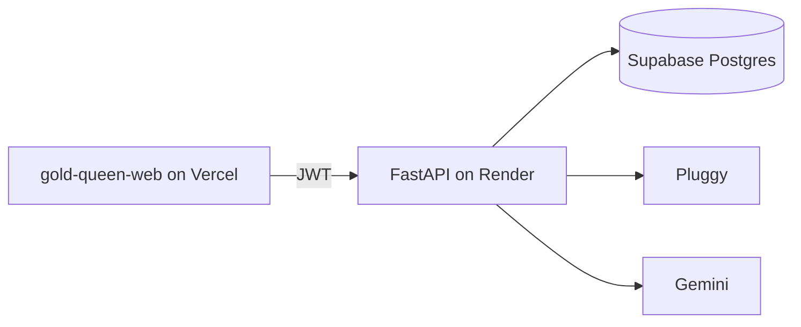

# Gold Queen API

FastAPI backend that aggregates Open Finance accounts, categorizes transactions, and answers questions about that treasury. It is the data layer for [gold-queen-web](https://github.com/luizssantiago92/gold-queen-web).

[](https://github.com/luizssantiago92/gold-queen-api/actions/workflows/ci.yml)
[](https://github.com/luizssantiago92/gold-queen-api/actions/workflows/codeql.yml)
[](https://www.python.org/downloads/)
[](LICENSE)

| | |
| --- | --- |
| Live app | https://gold-queen-web.vercel.app |
| API docs | https://gold-queen-api.onrender.com/docs |
| OpenAPI | https://gold-queen-api.onrender.com/openapi.json |

The public demo is read-only. These accounts are created by `python -m app.seed` (`app/seed.py`):

| Email | Password |
| --- | --- |
| `queen@goldqueen.dev` | `QueenDemo123!` |
| `squire@goldqueen.dev` | `SquireDemo123!` |

`POST /v1/connections/connect`, `POST /v1/connections/sync`, and `DELETE /v1/connections/{id}` return `403` with code `demo_read_only`. Reads, Queen's Tips, and chat still work. Each demo account's AI quota is counted per visitor IP.

## Architecture



The HTTP process stores no session. JWTs carry identity. Treasury rows and AI caches live in Postgres. Local runs and the test suite use SQLite when `DATABASE_URL` is unset. Without Pluggy credentials the sync path uses a deterministic sandbox. Without a Gemini key, categorization and advice use rule-based fallbacks and set `is_guarded` to false.

## What a backend review will find

- **Auth.** JWT access tokens (PyJWT, HS256) and bcrypt password hashes (`$2b$`, 12 rounds). Registration rejects a password longer than 72 UTF-8 bytes. `ENVIRONMENT=production` refuses the default `JWT_SECRET` and any secret shorter than 32 characters.
- **Errors.** Handled failures return `{ "detail": string, "code": string }`. A `422` also returns `errors` with `loc`, `msg`, and `type` only. The body does not echo the submitted value. An unexpected failure is `500` / `internal_error` with no traceback. Schemas, tags, and those error responses are in the OpenAPI document. `info.version` is read from `pyproject.toml` (`1.0.0`).
- **AI quota.** Chat and Queen's Tips share `CHAT_DAILY_LIMIT` (default 5). The same chat question on the same day is served from cache and does not consume quota. Advisor and chat accept English or Portuguese.
- **Sync.** A transaction is inserted only when its `pluggy_transaction_id` is new, so a repeat sync reports `transactions_synced: 0` for rows already stored and still updates balances. Connect and sync run in a worker thread. Pluggy HTTP is scheduled back onto the event loop. A first sync of a live item must match Pluggy's `clientUserId`.
- **Tests.** pytest, ruff, mypy, and `pip-audit` run in CI. Branch coverage fails under 85, set in `pyproject.toml`. There is no hosted coverage badge.
- **CI.** Third-party actions are pinned to commit SHAs. CodeQL analyzes Python and GitHub Actions. Dependabot opens weekly updates for pip and actions. Workflow tokens are `contents: read`.
- **Retornatus.** Behavior changes have a contract and evidence under `.retornatus/changes/` (C-0001 through C-0005). Pull requests run the `retornatus-gates` check.

Every response sends `X-Content-Type-Options: nosniff`, `Referrer-Policy: no-referrer`, `X-Frame-Options: DENY`, and `Strict-Transport-Security: max-age=31536000; includeSubDomains`. There is no `Content-Security-Policy`, so Swagger UI at `/docs` still loads.

## Stack

| Layer | Choice |
| --- | --- |
| Language | Python 3.11+ |
| API | FastAPI, Pydantic v2 |
| Data | SQLModel, Alembic, PostgreSQL (Supabase) / SQLite locally |
| Open Finance | Pluggy (`/v2/transactions`), offline simulator when credentials are absent |
| AI | Gemini via httpx (`gemini-3.6-flash`), schema guardrails in `app/core/ai_guardrails.py` |
| Auth | PyJWT, bcrypt |
| Host | Render (`render.yaml`). Web app on Vercel |
| Quality | pytest, ruff, mypy, pip-audit, CodeQL |

## Run locally

Tested on Linux with Python 3.12, without a `.env` file. Settings then fall back to SQLite (`gold_queen.db`).

```bash
python3 -m venv .venv
source .venv/bin/activate
pip install -r requirements-dev.txt
pytest
python -m app.seed
uvicorn app.main:app --host 127.0.0.1 --port 8000
```

Docs: http://127.0.0.1:8000/docs

On Windows, activate the venv with `.venv\Scripts\activate`.

Copying `.env.example` sets `DATABASE_URL` to the Postgres in `docker-compose.yml`. Postgres setup, Render, and Supabase are in [docs/deployment.md](docs/deployment.md). `python -m app.seed` creates users only. Linking a sandbox bank is described in [docs/demo-operations.md](docs/demo-operations.md). That script calls connect and sync as the demo user, so it cannot refresh a deploy where the read-only guard is on.

## Environment

Names and defaults only. Secret values stay in the host, not in git. See [.env.example](.env.example).

| Variable | Role |
| --- | --- |
| `DATABASE_URL` | SQLAlchemy URL. Empty or unset uses `sqlite:///./gold_queen.db`. |
| `ENVIRONMENT` | `development` (default) or `production`. |
| `JWT_SECRET` | HMAC key. Any value is accepted in development. Production requires a non-default value of at least 32 characters. |
| `JWT_ALGORITHM` | Default `HS256`. |
| `JWT_EXPIRE_MINUTES` | Default `1440`. |
| `PLUGGY_CLIENT_ID`, `PLUGGY_CLIENT_SECRET` | Pluggy credentials. Both empty means the offline simulator. |
| `PLUGGY_BASE_URL` | Default `https://api.pluggy.ai`. |
| `GEMINI_API_KEY` | Google AI Studio key. Empty means rule-based fallbacks. |
| `GEMINI_MODEL` | Default `gemini-3.6-flash`. |
| `CORS_ORIGINS` | Comma-separated exact origins. The default includes local dev, `https://gold-queen-web.vercel.app`, and the team alias. |
| `VERCEL_TEAM_SLUG` | Team that owns the web app. Default `luizssantiago92`. Used to build preview CORS. |
| `CORS_ORIGIN_REGEX` | Optional preview-origin override. Unset derives a pattern that ends with the team slug. Empty disables previews. |
| `LOGIN_RATE_LIMIT_MAX` | Login attempts per caller per window. Default `10`. The counter is in-process, not shared across instances. |
| `LOGIN_RATE_LIMIT_WINDOW_SECONDS` | Default `60`. |
| `LOGIN_TRUST_PROXY_HEADERS` | Default `true`. Reads `X-Real-IP` or the first `X-Forwarded-For` hop. |
| `MAX_BANK_CONNECTIONS` | Free-plan bank quota. Default `3`. |
| `CHAT_DAILY_LIMIT` | Shared daily quota for chat and Queen's Tips. Default `5`. |
| `ALLOW_REGISTRATION` | Unset follows the environment: open in development and test, closed when `ENVIRONMENT=production`. |

Do not send `PLUGGY_CLIENT_SECRET` or `GEMINI_API_KEY` to the browser.

## Layout

```
app/            routers, services, SQLModel tables, config, auth
alembic/        migrations
tests/          pytest
docs/           architecture, frontend contracts, deploy, demo ops
docs/history/   original product brief
.github/        CI, CodeQL, Dependabot, Supabase keep-alive
.retornatus/    change contracts and evidence
```

Guides: [docs/README.md](docs/README.md).

## Tests

```bash
pytest
ruff check app tests scripts alembic
ruff format --check .
mypy
pip-audit -r requirements-dev.txt
```

CI runs those commands and `pytest --cov=app --cov-report=term-missing`. The coverage floor is `[tool.coverage.report] fail_under = 85` (branch coverage).

## API

| Method | Path | Role |
| --- | --- | --- |
| `GET` | `/health` | Liveness. `?db=1` runs `SELECT 1`. `?deep=1` probes Gemini. |
| `POST` | `/v1/auth/register`, `/v1/auth/login` | Account and JWT |
| `GET` | `/v1/auth/me` | Current user |
| `POST` | `/v1/connections/connect`, `/v1/connections/sync` | Link and sync a bank |
| `DELETE` | `/v1/connections/{id}` | Unlink a bank and its rows |
| `GET` | `/v1/dashboard/overview` | Balances and month totals |
| `GET` | `/v1/advisor/queen-tips` | Daily diagnosis |
| `POST` | `/v1/chat/query` | Question about the treasury |

`GET /` redirects to `/docs` and is omitted from the schema. The full list, including dashboard feeds, is in `/docs` and [docs/frontend-integration.md](docs/frontend-integration.md).

## Roadmap

The original brief described card products and investment suggestions. Neither exists in this API. The public demo stays on sandbox data and the read-only guard.

## License

[MIT](LICENSE). Copyright 2026 Luiz Santiago.

## Author

Luiz Santiago, Rio de Janeiro. GitHub: [luizssantiago92](https://github.com/luizssantiago92).
