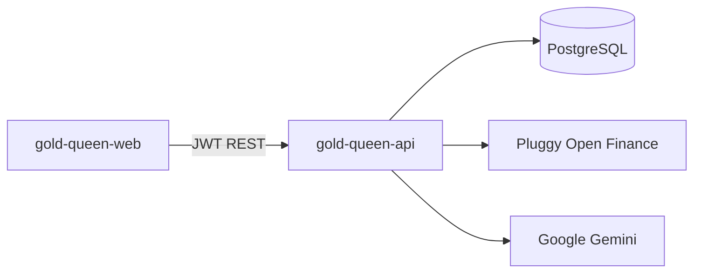

# Architecture

## System context



The API is stateless at the HTTP layer. Session state lives in JWTs; treasury data and AI caches live in PostgreSQL.

## Application layers

```
app/
├── main.py              FastAPI app, CORS, lifespan, /health
├── routers/             HTTP adapters (thin)
├── schemas/             Pydantic request/response models
├── services/            Business logic
├── models/entities.py   SQLModel tables
└── core/                Config, DB, security, AI guardrails
```

Routers delegate to services and never call Pluggy or Gemini directly.

## Core services

| Service | Responsibility |
| --- | --- |
| `pluggy.py` | OAuth-style API key auth, `/v2/transactions` pagination, offline simulator |
| `sync.py` | Item → accounts → transactions; insert-only dedup by `pluggy_transaction_id` |
| `ai.py` | Gemini calls + keyword fallbacks for categorization, tips, chat |
| `treasury.py` | Balance aggregation, monthly totals, display categories, transaction queries |
| `display_category.py` | Maps descriptions + account type into UI buckets (Subscriptions, Bills, …) |
| `demo_refresh.py` | Shifts demo transaction dates forward when the calendar month advances |
| `rate_limit.py` | Daily token bucket shared by chat and Queen's Tips |

## Data model

| Table | Purpose |
| --- | --- |
| `users` | Accounts with bcrypt password hashes |
| `bank_connections` | One Pluggy item (institution) per user link |
| `accounts` | Checking/credit accounts under a connection |
| `transactions` | Synced movements with AI `category` and `is_guarded` flag |
| `chat_cache` | Same question + same day → cached answer |
| `chat_usage` | Daily request counter per user |

Relationships: `User` → `BankConnection` → `Account` → `Transaction`.

## Sync pipeline

1. Frontend obtains `connect_token` and completes Pluggy Connect (or demo uses pre-seeded item).
2. `POST /v1/connections/sync` fetches accounts and paginated transactions.
3. New rows are categorized via Gemini (or fallback); guardrails validate the category.
4. Dashboard endpoints read from PostgreSQL only — no live Pluggy calls on page load.

## Dashboard aggregation

All dashboard routes call `maybe_refresh_demo()` for demo emails, then:

- **Overview** — sum balances, compute month income/expenses.
- **Categories** — group current-month expenses by `display_category`.
- **Monthly series** — cumulative daily expenses from day 1 through today.
- **Transactions** — current month only, paginated, newest first.

## AI guardrails

Every generative path (categorize, queen-tips, chat) follows:

1. Build grounding context from `treasury.build_ai_summary()` (balances, categories, product rules).
2. Call Gemini with a JSON-only prompt.
3. Parse and validate with `ai_guardrails`.
4. On failure → rule-based fallback, `is_guarded: false`.

Product rules (bank limit, daily quota) are injected into the summary so the model cannot contradict them.

## Security

- JWT bearer authentication on all `/v1/*` routes except auth register/login.
- Users can only access their own connections and transactions (scoped queries).
- Secrets (`JWT_SECRET`, Pluggy, Gemini) are server-side only.
- CORS allowlist + regex for Vercel preview deployments.

## Deployment topology

| Component | Provider | Notes |
| --- | --- | --- |
| API | Render (Oregon) | Free tier cold start ~50s |
| Database | Supabase (São Paulo) | Session pooler, IPv4-friendly host |
| Frontend | Vercel | `VITE_API_BASE_URL` points to Render |

See [deployment.md](deployment.md) for connection strings and env vars.
