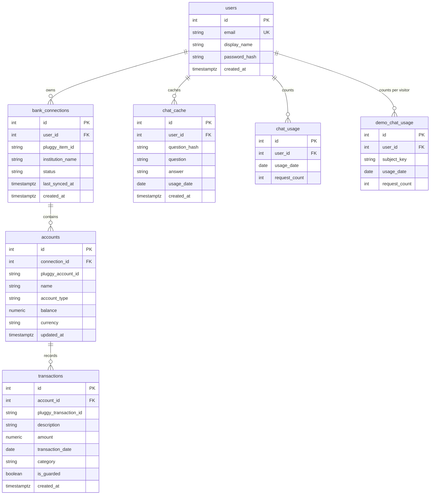

# Data model

PostgreSQL schema at Alembic head `c7a1b5e0d942`, taken from `app/models/entities.py` and `alembic/versions/`. Startup does not create these tables. A fresh database runs `alembic upgrade head`. SQLite, used when `DATABASE_URL` is unset, creates the same SQLModel tables with `create_all` and is not this diagram.

Money columns are `numeric(14, 2)`. Integer primary keys are assigned by the database. Foreign keys do not declare `ON DELETE`. Unlinking a bank deletes transactions, then accounts, then the connection in `app/services/sync.py`.



## Tables

### `users`

Account row. `email` is a unique index (`ix_users_email`). `password_hash` is a bcrypt `$2b$` string. `created_at` is timezone-aware UTC. The API response for a user does not include the hash.

### `bank_connections`

One Pluggy item linked by a user. `user_id` references `users.id` and is indexed. `pluggy_item_id` is indexed and is not unique in the schema; ownership is enforced in `sync.py`. `status` defaults to `PENDING` and a finished sync sets `UPDATED`. `last_synced_at` is null until the first sync.

### `accounts`

A checking or credit account under a connection. `connection_id` references `bank_connections.id`. `pluggy_account_id` is indexed and is not unique in the schema; sync matches it within the connection. `account_type` defaults to `BANK`. `balance` defaults to 0. `currency` defaults to `BRL`. `updated_at` moves when a later sync refreshes the balance.

### `transactions`

A movement under an account. `account_id` references `accounts.id`. `pluggy_transaction_id` is indexed and is not unique in the schema; sync inserts a row only when that id is new for the account. `amount` is a signed `numeric(14, 2)`. `category` defaults to `Uncategorized` and is then set to the closed vocabulary. `is_guarded` defaults to false and is true only when the model batch passed the guardrail. `transaction_date` is indexed. Display categories used by the dashboard are computed at read time and are not stored.

### `chat_cache`

Same-day reuse of a chat answer or a Queen's Tips payload. `user_id` references `users.id`. Chat rows store the question text and the answer. Tips rows store the key `queen-tips` and a JSON object. Lookup is `(user_id, question_hash, usage_date)`. That triple is indexed per column and is not a unique constraint, so two racing misses can insert two rows; the tips reader keeps the newest id.

### `chat_usage`

Daily counter for a normal account. Unique constraint `uq_chat_usage_user_date` on `(user_id, usage_date)`. `request_count` increments with one upsert while it is still under `CHAT_DAILY_LIMIT`. The table has no timestamp columns.

### `demo_chat_usage`

Daily counter for a shared demo account, split by `subject_key` (the client address, at most 128 characters). Unique constraint `uq_demo_chat_usage_subject_date` on `(user_id, subject_key, usage_date)`. Created by revision `c7a1b5e0d942`. No timestamp columns.

## Revisions

| Revision | Effect |
| --- | --- |
| `a630d3c39926` | Creates `users`, `bank_connections`, `accounts`, `transactions`, `chat_cache`, and `chat_usage`. Timestamps are `timestamp without time zone`. |
| `c7a1b5e0d942` | Adds `uq_chat_usage_user_date` after summing duplicate counters into the oldest row. Creates `demo_chat_usage` when it is missing. On PostgreSQL, converts the six timestamp columns above with `AT TIME ZONE 'UTC'`. |

`chat_usage` and `demo_chat_usage` are not in that timestamp list. Downgrade of `c7a1b5e0d942` converts timestamps back to naive UTC and drops the unique constraints. It leaves `demo_chat_usage` in place and does not split merged counters.

## Row-level security

The Alembic revisions do not enable row-level security and do not create policies.

On the production Supabase project, RLS is already enabled on `users`, `bank_connections`, `accounts`, `transactions`, `chat_cache`, and `chat_usage` by the Supabase migration `enable_row_level_security` ([deployment.md](deployment.md)). `demo_chat_usage` comes from Alembic. If that table does not already have RLS, enable it once in the Supabase SQL editor:

```sql
ALTER TABLE public.demo_chat_usage ENABLE ROW LEVEL SECURITY;
```

The frontend does not connect to Supabase. This API uses the table-owner connection string, which bypasses RLS, so the project has no policies. Isolation between users is the `user_id` filter in the application queries.
