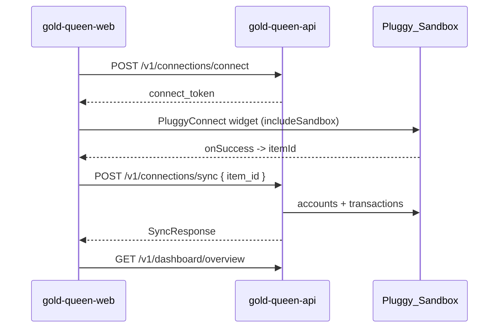

# Frontend Integration Guide

How `gold-queen-web` (React + Vite + TypeScript) talks to `gold-queen-api`.

## Base URL and CORS

| Environment | Base URL |
| --- | --- |
| Local | `http://127.0.0.1:8000` |
| Production | Value of `VITE_API_BASE_URL` |

The API must list the frontend origin in `CORS_ORIGINS`. Local defaults already include `http://localhost:5173`.

## Authentication

The frontend authenticates once and stores the returned JWT.

```ts
// POST /v1/auth/login
const { access_token } = await api.post("/v1/auth/login", {
  email: "queen@goldqueen.dev",
  password: "QueenDemo123!",
}).then((r) => r.data);
```

Every subsequent request carries the token:

```ts
axios.defaults.headers.common.Authorization = `Bearer ${access_token}`;
```

A `401` means the token expired: clear it and route back to login.

## Open Finance flow



1. Call `POST /v1/connections/connect` to obtain a 30-minute `connect_token`.
2. Open the widget with `<PluggyConnect connectToken={token} includeSandbox />`.
3. On `onSuccess`, post the returned `itemId` to `POST /v1/connections/sync`.
4. Refresh the dashboard queries.

If the user already has 3 banks, step 1 returns `403` with code `connection_limit_reached`.

## Response contracts

### `GET /v1/dashboard/overview`

```json
{
  "total_balance": "2330.78",
  "currency": "BRL",
  "banks": [
    {
      "connection_id": 1,
      "institution_name": "Nubank",
      "balance": "1430.20",
      "share_percentage": 61.36
    }
  ],
  "month_expenses": "845.10",
  "month_income": "3200.00",
  "reference_month": "2026-08"
}
```

`share_percentage` feeds the multi-color progress bar on the balance card.

### `GET /v1/dashboard/categories`

```json
{
  "reference_month": "2026-08",
  "total_expenses": "845.10",
  "categories": [
    { "category": "Food", "total": "310.40", "share_percentage": 36.73, "transaction_count": 7 }
  ]
}
```

### `GET /v1/dashboard/monthly-series`

```json
{
  "reference_month": "2026-08",
  "total_expenses": "845.10",
  "points": [
    { "date": "2026-08-01", "cumulative_expenses": "42.90" },
    { "date": "2026-08-02", "cumulative_expenses": "118.35" }
  ]
}
```

The series is cumulative and monotonic, with one point per elapsed day of the
month — it stops at today rather than running to the end of the month, so the
chart never shows a flat tail into the future. `total_expenses` always equals
the last point and matches `month_expenses` from the overview.

### `GET /v1/dashboard/transactions?page=1&limit=20`

```json
{
  "items": [
    {
      "id": 12,
      "description": "Padaria do Reino",
      "amount": "-42.90",
      "transaction_date": "2026-08-24",
      "category": "Food",
      "is_guarded": true,
      "institution_name": "Nubank"
    }
  ],
  "page": 1,
  "limit": 20,
  "total": 38
}
```

Render the golden `ShieldCheck` icon only when `is_guarded` is `true`.

Amounts are decimal strings: negative means expense, positive means income. Parse with a decimal-safe helper rather than `parseFloat` for display math.

### `GET /v1/advisor/queen-tips`

```json
{
  "critical_expense": "...",
  "management_status": "...",
  "smart_guidance": "...",
  "is_guarded": true,
  "from_cache": false
}
```

These map to the three scroll sections of the "Dicas da Rainha" modal.

### `POST /v1/chat/query`

Request:

```json
{ "question": "Como protejo meu ouro?" }
```

Response:

```json
{
  "answer": "...",
  "from_cache": false,
  "remaining_requests": 7,
  "daily_limit": 10
}
```

Use `remaining_requests` to display the remaining audiences with the Queen.

## Error handling

Every handled error returns the same shape:

```json
{ "detail": "human readable message", "code": "machine_readable_code" }
```

| Status | Code | Frontend behaviour |
| --- | --- | --- |
| `401` | `unauthenticated` | Clear token, redirect to login |
| `403` | `connection_limit_reached` | Show the Free plan limit message |
| `409` | `conflict` | Email already registered |
| `429` | `rate_limit_reached` | Show the Queen's quota speech bubble |
| `502` | `upstream_error` | Ask the user to retry the sync |

For `429`, `detail` already carries the in-persona text:

> A Rainha precisa recolher-se aos seus aposentos para balancear o tesouro real. Retorne em 24 horas para novos conselhos sobre o seu ouro.

## Suggested TanStack Query keys

| Key | Endpoint |
| --- | --- |
| `["overview"]` | `/v1/dashboard/overview` |
| `["categories"]` | `/v1/dashboard/categories` |
| `["monthly-series"]` | `/v1/dashboard/monthly-series` |
| `["transactions", page]` | `/v1/dashboard/transactions` |
| `["queen-tips"]` | `/v1/advisor/queen-tips` |

Invalidate all of them after a successful `POST /v1/connections/sync`.

## Generating a typed client

The API publishes an OpenAPI schema at `/openapi.json`:

```bash
npx openapi-typescript http://127.0.0.1:8000/openapi.json -o src/types/api.d.ts
```
